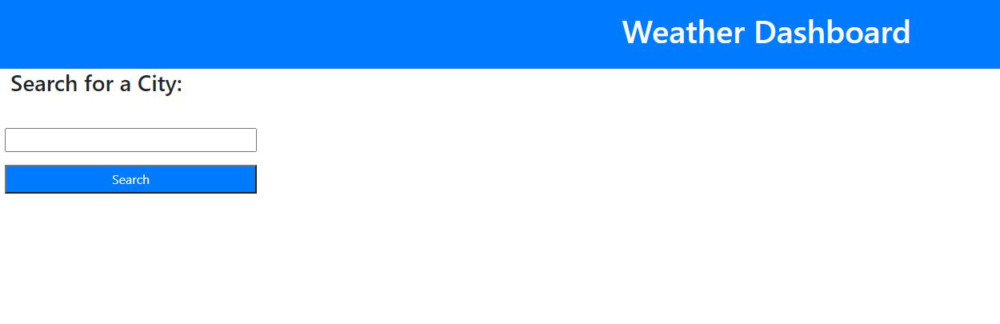
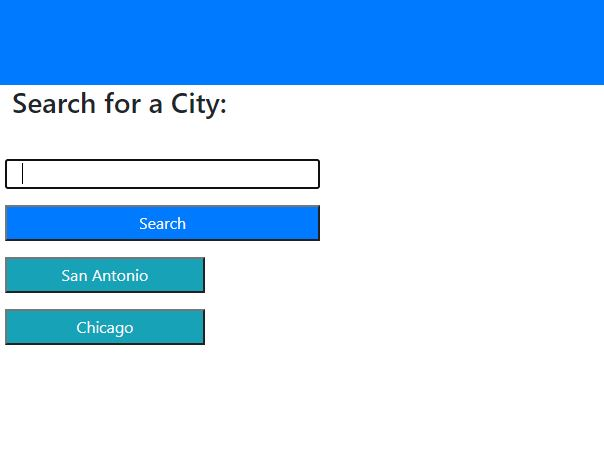
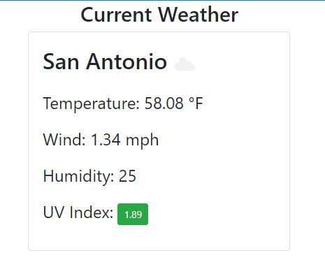
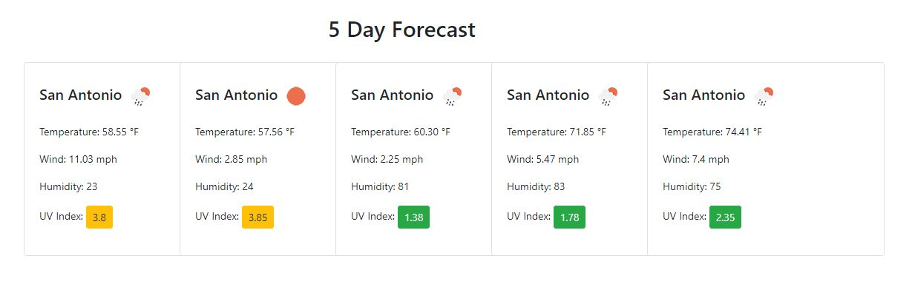

# Weather Dashboard
Display current and future weather forecasts for any city!

## Table of Contents
* Intro
* City Search
* Current Forecast
* Future 5 Day Forecast
* Conclusion

## Intro
The weather dashboard provides user with an easy way to display current and future weather conditions for any city. Just simply type in the desired city into the search bar, click search, and you have your weather! Using the weather dashboard, users can plan their days accordingly.

## City Search
Once the webpage is loaded, users will be presented with a search bar prompting them to please enter a city. An example of this is shown below:

The user just has to simply type in any city, click the blue search button, and the weather will be displayed. Once a city is entered, that city will be saved in a previous city search list below. An example of the previously searched cities is shown below:

## Current Forecast
Once a city is entered, the current forecast for that city is diplayed. The user will be presented with the name of the city they inputted and 4 different current weather conditions: temperature, wind, humidity, and uv index. This way the user can easily see the currenty condition to plan their day accordingly. An example of what the user might see when they enter a city is shown below:

## Future 5 Day Forecast
Along with the current weather conditions, the user is presented with a future 5 day weather forecast. Each of the 5 days provides the user with the same data as the current weather forecast. Each will have the temperature, wind, humidity, and uv index for that day. An example of this is shown below:

## Conclusion
Using the weather dashboard is a quick and easy way to determine current and future weather conditions for any city in the world. Users will be able to use the data presented to plan each day accordingly according to the 4 conditions: temperature, wind, humidity, and uv index.

Please visit the link below to check out the weather dashboard:

